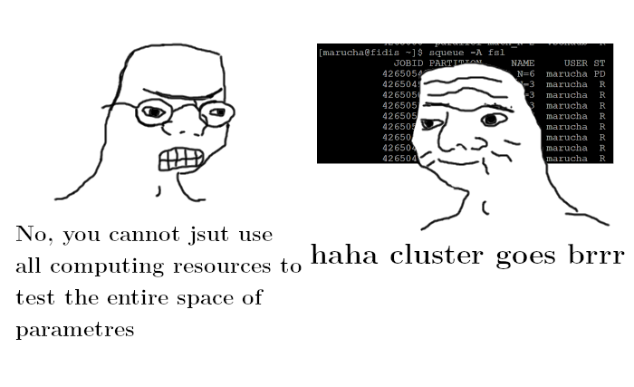

# S-matrix numerical bootstrap

## Quick start guide

1. Upload the package to the cluster
2. Generate `sample_points/list_samples.m` using `sample_points/generate_objects.m`
    - there is value `maxN` in the file that should be adjusted
3. Populate `sample_points/data` using `sample_points/run_samples.py`
    - adjust the file `sample_points/util.m` as well as the file `sample_points/run_samples.py`. Second one contains spin range as globals.
    - there is a lattice of 400 points precomputed and saved at `/work/fsl/brane_int` up to spin 55.
4. Prepare SDPB problems using `construct_problems.py`
    - `construct_problems.py` has the list of `[valN, valMaxN, valMaxSpin]` which correspond to ones of `bootstrap.m`. This is stuff we compute. `util.m` should match `sample_points/util.m`, I'm too afraid to think what happens if it doesn't
5. Run SDPB problems using `run_problems.py`
    - `run_problems.py` has two options, `precision`, which is (binary) length of numbers used in computation. `4 * working_precision` should be a good guess, as `log2(10) < 4`. There is also a mysterious `dualityGapThreshold` parameter.
6. *haha, cluster goes brrrrr*
7. Have the problem of cosmological constant solved.

## How to cluster

There are three clusters available, `deneb`, `fidis` and `helvetios` (`helvetios` being the most recent). To log in to a frond-end use SSH over EPFL's VPN. Adresses  are:

`deneb1.epfl.ch`

`deneb2.epfl.ch`

`fidis.epfl.ch`

`helvetios.epfl.ch`

For Windows PuTTY is the best option (and Filezilla for uploading files, with `sftp://fidis.epfl.ch` as host).

The magic comand for scheduling tasks on the cluster is
`sbatch your_bash_script.run`. There are some nice examples at [scitas-examples](https://c4science.ch/diffusion/SCEXAMPLES/scitas-examples.git) git repo. The finished tasks will produce some slurp files, which are runtime info and strout of the process.

You can use `sbatch --partition=debug your_bash_script.run` for short, testing-purpose jobs, however the computing time is super-limited.

## List of programs

### `amplitudes.m`

Honestly, this is a great mystery (and the most physical part).

### `bootstrap.m`

This script converts abstract s-dependent problem of semi-definitness to set of problems on lattice of discrete values of s. The key functions are:

`constructSDPProblem[valN][valMaxN, valMaxSpin]`

`constructSDPData[valN][valMaxN, valMaxSpin]`

with parametres

- `valN` - O(N) (global) symmetry of the problem
- `valMaxN` - the maximal power of s (and t and u) to which the amplitude function is expanded. Don't be surprised by its lack in the code - it works via defining a global to be used in `amplitudes.m`
- `valMaxSpin` - biggest Lagendre polynomial into which amplitude is expanded (or into how many partial waves it is decomposed)

Files from `sample_points/data` define the grid and provide some useful integrals for partial wave decomposition and the output will be a gargantous set of Mathematica files defining SDPB problems.

### `sample_points/evaluation.m`

Populate the folder `sample_points/data` with values of integrals from `sample_points/list_objects.m` at precision given at `sample_points/util`. These are partial wave decompositions of basis of amplitudes given in ansatz in `amplitudes.m`.

### `sample_points/generate_objects.m`

Populates the file `sample_points/list_objects.m` up to given order in ρ's. The definitions come from `amplitudes.m`.

### `sample_points/list_objects.m`

Contains the integrals to be precomputed in `sample_points/evaluation.m` with the partial wave decomposition of powers of ρ at given parameter s.

### `sample_points/util.m`

Some commons used by all scripts in the folder. The important ones are `s0` which is point around which ρ is expanded, `mass` which is 0 for our phonons and `working_precision` which is the favorite large number. The favorite large number of Dennis is `150`, which is proved to be a best number. `numberGridPoints` is number of different `s` for which unitarity will be tested.

### `sample_points/run_samples.py`

Schedules the execution of `sample_points/evaluation.m` on the cluster.

### `util.m`

This is a lost twin sister of `sample_points/util.m`. It contains `prec` which should be equal to `working_precision`, `z0` which is deceivingly equal to `s0` and switching instruction `problemType` which now allows only the value `"A1Bound_A0=1"` but oh god, in the future it will be so much more (probably `"A0Bound_A1=1"`). Also, not syncing the mentioned values with `sample_points/util.m` can lead to the catastrophes of a cosmic scale.

### `wtfirun`

A list of tasks run by current user.

### `problems/sdp2input`

This binary converts Mathematica files generated by previous stuff to SDPB input

### `problems/sdpb`

Unholy power of S-Matrix bootstrap trapped into a single binary.

## Troubleshooting

### 1. No problems are generated by `generate_problems`

This may be related to lack of proper permissions. `chmod +x problems/sdp2input` should fix it.

### 2. SDPB dies immidiatly after starting

Well, shit happens.

### 3. SDPB doesn't generate out.txt

It's because it dies. Shit happens.

## Plans for the future
